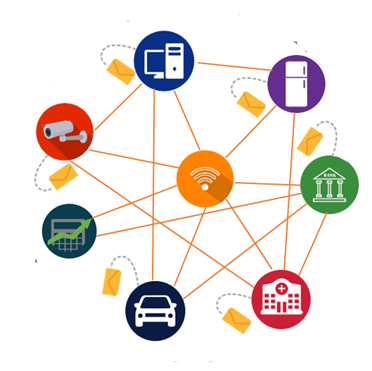
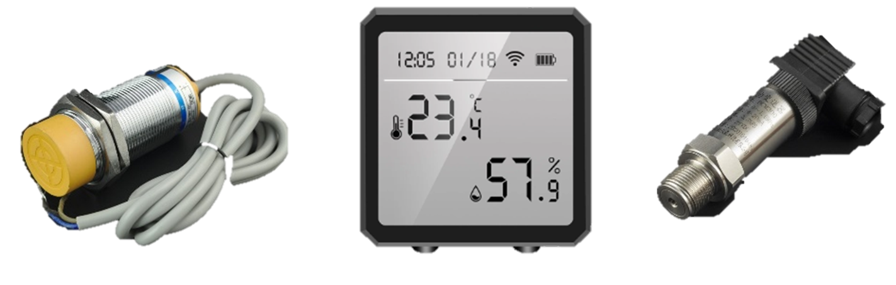

# Proyecto - Aplicación Móvil para la configuración de sensores y actuadores remotos 

### Conocimientos Previos
___
Para una mejor comprensión acerca del contenido del documento es preferente conocer de antemano algunos de los siguientes temas:

* Conocimiento básico Redes.
* Conceptos básicos del protocolo *UDP*.
* Internet de las cosas.
* Arquitecturas de software cliente - servidor
* Uso de microcontroladores.
* Lenguajes de programación, *Java*, *Kotlin*.
* Programación de aplicaciones móviles.
* Conceptos generales acerca del entorno de desarrollo *Android Studio*.
* Estar familiarizado con *Jetpack Compose*

## 1 Contexto 
___

En la época actual la tecnología y su uso ha evolucionado a pasos agigantados, cada vez es mas común su presencia en la vida cotidiana de las personas ayudandolas en sus necesidades más básicas. Por esto no es nada raro pensar también en la IoT *"Internet Of Things"* ya que en conjunto con la tecnología son un gran apoyo al momento de realizar tareas desde las más sencillas *p. ej.* prender la luz de una habitación o abrir una puerta, hasta cosas más sofisticadas *p. ej.* en empresas especializadas en transporte se utiliza para dar seguimiento a sus activos y optimizar el consumo de combustible y de las rutas marítimas, y asi podemos hacer una lista enorme sobre todas las cosas que podemos hacer usando las *IoT*.

Antes de continuar, que son la *IoT*?, bueno en términos sencillos se refiere a la red de objetos físicos que tienen incorporados sensores, softwares y otro tipo de tecnologías con el propósito de conectarse  e intercambiar datos con otros dispositivos y sistemas a través de Internet. Se puede apreciar un esquema en la figura 1.

Cabe mencionar que puede tomar un enfoque ligeramente diferente cuando su uso se aplica en el sector industrial, conocida como "*IoT* Industrial" hace referencia al uso de sensores inteligentes y mecanismos de automatización cuya funcion en conjunto permite mejorar la eficiencia de procesos industriales a niveles diferentes.En resumen, consiste en conectar máquinas con dispositivos y sistemas empresariales mediante la arquitectura de red para que puedan comunicarse, recopilar información y analizar esos datos en tiempo real.

Con esto las personas, máquinas y los datos pueden trabajar de manera sincronizada para ofrecer un valor añadido 

## 2 Marco Teórico
___ 

A lo largo de los ultimos años, la industria ha optado por hacer más recurrente el uso de sensores dentro de su marco de trabajo, ya que es un elemento muy versátil que ayuda en muchas tareas, como facilitar las tareas de automatización.

Gracias a que miden variables de diferente indole:

*Ambientales*: Hace referencia a los elementos naturales como la velocidad y dirección del viento, temperatura del ambiente, humedad, la intensidad de la luz entre otras cosas.

*Mecánicas*: Relacionadas con la maquinaria de la organización.

*Variables de proceso*: Son aquellas relacionadas con las condiciones físicas o químicas que se originan durante los procesos activos.

*Eléctricas*: Son aquellas variables que afectan directamente a los activos de la organización, como por ejemplo, el voltaje, la corriente, la frecuencia, la resistencia, potencia, etc.

Debemos recordar que en función del tipo de variable que miden se pueden categorizar los sensores p. ej.:

|Tipo de sensor        | Descripción |
|----------------------|-------------|
|Temperatura         | Este tipo de sensor reúne estímulos referentes a la temperatura de una fuente concreta y lo transforma en información.|
| Presión          | Estos sensores obtienen la información en forma de presión y la transforman en señales eléctricas.| 
|Medición|Los sensores de mediación tienen la función de medir la distancia entre dos elementos o su posición, por lo que hacen más eficiente la optimización de los procesos de control.|
|Proximidad |La función de estos sensores es detectar objetos, señales o personas que se encuentren cerca del sensor.|

Como se observa en la figura 2 se muestran algunos tipos de sensores como de proximidad (izqueirda), de temperatura (en medio) y de presión (derecha). Sin embargo este tipo de elementos tienen algunos inconvenientes como lo es su manipulación la cual es exclusivamente para personas con amplia experiencia tanto en el tema como en la interaccion con este tipo de aparatos. Si por alguna razón logramos acceder a este tipo de herramientas podemos notar que usan lenguaje técnico lo que ocaciona que para nosotros sea una tarea practicamente imposible tan siquiera saber lo que queremos hacer, si bien también las empresas suelen dar guías de configuración, estas generan el mismo problema, p. ej. para configurar un sensor optico de fibra digital es necesario leer un manual extenso, engorroso y puede que hasta confuso como el que se muestra en la figura 3  

Otras empresas optan por el desarrollo de aplicaciones ya sean móviles o de escritorio para realizar este mismo proceso lo cual facilita enormemente este proceso aunque sus principales usuarios siguen siendo especialistas o gente experimentada, en la figura 4  podemos ver ejemplos de aplicaciones de configuración de sensores.

En base a estos antecedentes, nosotros queremos llevar un poco más allá esta idea al grado de simplificar aún más este proceso para los usuarios y hacer en lo mayor de lo posible que cualquier persona con los conocimientos mínimos pueda llevar a cabo estar tareas.

# 3 Caso de estudio

Durante el año 2020 y 2021 el mundo sufrió una serie de cambios que nos llevo al confinamiento durante la pandemia ocacionada por el *SARS COV 2*, Coronavirus o *COVID-19* como también se le conoce, este confinamiento llego a limitar algunas tareas para las personas debido a que el nivel de contagio era alto y lo más recomendable era no salir para nada de sus hogares, aunado a esto se marcó un auge en el uso de aplicaciones móviles y otras herramientas digitales  que hicieron más accesible sobrellevar toda esta situació.

Conforme iban avazando las etapas de la pandemia, la sociedad poco a poco se adaptó a esta nueva normalidad teniendo como fuente de interacción principal sus dispositivos móviles, aproximadamente entre finales del 2021 e inicios del 2022 los gobiernos de varios países crearon y estructuraron planes de emergencia para el manejo de esta crisis sanitaria que se extendió al sector económico debido al cierre de comercios y las perdidas de empleo masivas a nivel global.

Dichos planes o iniciativas se crearon con el propósito de levantar las economías de los países y empezar la transición hacía una "nueva normalidad", algunas de estas medidas son: 

* *Distancia interpersonal de 1.5 tanto para espacios públicos como cerrados.*

* *Uso de cubrebocas en todo momento, recomendando el KN-95 como la mejor opción bajo estas circunstancias*.

* *Lavado de manos frecuentemente*

* *Tener un control de la capacidad de personas que pueden estar en un establecimiento (principalmente restaurantes, bares, centros comerciales, escuelas etc..)

Si bien los primeros 3 puntos son sencillos de seguir, el último puede generar varios obstáculos para que se cumpla de la mejor manera ya que en algún momento puede salirse de control la situación y ser un punto de contagio que pone en riesgo la vida de las personas, puede que en un principio pensemos que no podemos tomar el control o que simplemente seria una tarea dificíl o tediosa estar contando a las personas que entran y salen, además de saber cuando el ambiente es el más apropiado para evitar contagios.

Este seguimiento puede llevarse a cabo con un sistema de monitorización ya que de esta manera se obtiene información del entorno donde se despliega para después hacer su respectivo análisis, cabe señalar que estos tipos de sistemas ofrecen diversas ventajas como:

* Prevención y detección de problemas.
* Ahorro de costes y tiempo.
* Detectar el origen del problema
* Acceso al estado del sistema en tiempo real.

Entonces la idea principal queda de la siguiente manera:

El sistema de monitorización consta de una red de sensores inalámbricos de 4 tipos (temperatura, CO2, humedad, infrarrojos para conteo de personas) cada uno recolecta y analiza sus propios datos y los mandan a un sumidero de datos para que puedan ser consultados a través de un servicio web.

Por otro lado, la configuración de los sensores se puede hacer a través de una aplicacion móvil diseñada principalmente para el sistema operativo Android (desde su versión 5.0 *Lollipop* hasta una versión antes de Android 11), los detalles acerca de la aplicación se describen en la siguiente sección.

# 4 Aplicación  CF APP

Como se mencionó anteriormente, varias empresas han desarrollado aplicaciones que se encargan de la configuración de sus propios sensores vía remota, se toma esto como base dando como valor agregado el poder simplificar este proceso bajo nuestro caso de estudio.

El objetivo de la aplicación es que de manera intuitiva y fácil un usuario con poca experiencia en el campo pueda realizar la configuración/actualización necesaria para cada uno de los dispositivos, el proceso que se lleva a cabo para realizar esto es el siguiente:

1- Cada uno de los sensores debe estar conectado ya sea a una red *WIFI* o un *Hotspot*.

2- Una vez que la conexión esta hecha, la aplicación detecta los dispositivos que se encuentran en la misma red y los enlista para que el usuario escoja cual es el que desea configurar/actualizar.

3- Al momento de seleccionar el dispositivo de su interés, enseguida se muestra una interfaz con todas las características configurables del dispositivo, en este caso son dos secciones una dedicada al apartado de Red y otro a las características en general.

4- Una vez que el usuario terminó de configurar, para que el proceso este completado debe enviar la información con ayuda de un botón.

5- Por último, el dispositivo recibe la información y aplica los ajustes correspondientes para que este listo para funcionar según las necesidades del usuario.

## 4.1- Herramientas para el desarrollo de la aplicación
___

En principio, debemos de tener claro las herramientas que se van a utilizar, en este caso usamos los lenguajes *C++* para la programación de los sensores, *Java* y *Kotlin* en la parte de la aplicación móvil, entornos de desarrollo como *Visual Studio Code*, y extensiones para la programación de *Arduino* como *PlatformiIO* *Android Studio*,  programas de diseño para las interfaces como *Figma*, la parte del hardware es brindada por los microcontroladores *ESP-32* que en conjunto con los sensores infrarrojos, temperatura, humedad y *C02* forman el dispositivo que se puede configurar a través de la aplicación, ya por último para realizar la configuración de los dispositivos es con ayuda de archivos en formato *JSON* a los cuales bajo nuestro caso de estudio se llaman archivos de configuración.

## 4.2 Detección de dispositivos en la red 
(*NSD* API ANDROID)
___

Para iniciar el proceso de la conexión inicial, primero tanto la app como cada uno de los dispositivos deben de estar conectados a la misma red *WIFI* o un *hotspot*, enseguida, se hace una búsqueda a nivel de servicios de la red para los dispositivos compatibles, cabe resaltar que la aplicación esta diseñada para que reconozca aquellos dispositivos que implementen el servicio *TFTP* que se explica con detalle más adelante, toda esta información esta oculta para el usuario ya que es ocupada a nivel interno de la aplicación y lo único que se le muestra al usuario es la lista final de los dispositivos compatibles. Cada dispositivo dentro de la red tiene un identificador único, esto facilita a la aplicación a no cometer errores al mandar los archivos de configuración al dispositivo incorrecto, en el caso de que se detecte algún problema saber el origen de este y por último llevar un orden. `Uamensor(#)` es el identificador elegido para los dispositivos donde `#` es un número generado de forma aleatoria.

El descubrimiento de servicios en la red es posible gracias a una *API* de *Android* que simplifica este proceso, cuyo nombre es *NSD "Network Services Discovery"*, la cual otorga a la app acceso a los servicios que otros dispositivos proporcionan en una red local. Así, los usuarios podrán identificar otros dispositivos de la red local que admitan los servicios que la aplicación solicita. Cabe señalar que cada dispositivo registra/anuncia el tipo de servicio que ofrece (*TFTP*) de manera automática para que sea encontrado en la red más adelante, esto es posible usando *MDNS*, el cual permite anunciar información sobre los servicios de red que ofrece el dispositivo.

En base a lo anterior, la aplicación se encarga de buscar en la red por un periodo de tiempo aquellos dispositivos que brinden el servicio *TFTP*, preguntando el tipo de sevicio que ofrece, en caso de que la respuesta sea afirmativa, se añade a una lista que posteriormente se le muestra al usuario dentro de la app para seguir con el proceso de configuración. En la figura 10 se observa un esquema general del trabajo que realiza la API y como es ocupada en el desarrollo del proyecto.

## 4.3 Proceso de Comunicación App - Dispositivo 
___

Enseguida de que son listados los dispositivos disponibles para ser configurados, se presenta una parte importante del proyecto: la comunicación entre la aplicación y el dispositivo para que se lleve a cabo su configuración.

Para lograr esto, el proceso se basa en una arquitectura tipo cliente-servidor debido a la naturaleza del servicio *TFTP*, la labor del servidor esta dada por el dispositivo y del lado del cliente nos encontramos con la aplicación, cabe señalar que el tipo de solicitudes que solicita el cliente son tipo *pull*, es decir, que el cliente solo se encarga de obtener la información que le es necesaria del servidor y en este caso se presentan en una interfaz dentro de la aplicación

## 4.4 Requerimientos funcionales 
___

Los requerimientos funcionales de la aplicación son los siguientes.

* El usuario pueda identificar y visualziar  los dispositvios compatibles para configuración dentro de la app.

* Poder conectarse con un dispositivo compatible.

* Se le muestren al usuario tanto la configuración de red como las caracteristicas principales del dispositivo compatible.

## 4.5 Diseño de interfaces
___

El diseño de las interfaces fue con ayuda de la herramienta *Figma*, a continuación se muestra el flujo de usuario esperado asi como prototipos de baja fidelidad de cada una de las interfaces que conforman a la aplicación y una breve descripción de la interacción que se espera por parte del usuario.

### 4.5.1 Interfaz de inicio

Como se ilustra en la figura 12 la intefaz se muestra inmediatamente de que el usuario inicia la aplicación, aqui se encunetra un texto el cual brinda las instrucciones necesarias para que el usuario sepa que hacer a continuación, seguido de el botón se encarga de hacer la busqueda dentro de la red de los dispositivos compatibles con la aplicación (para mayores detalles consultar la sección 4.2 de este documento) 

 

### 4.5.2 Interfaz lista de dispositivos compatibles 

Una vez que se reconocieron durante un periodo de tiempo todos los dispositivos compatibles, estos se presentan en forma de lista, cada elemento consta de una tarjeta con la información relevante del dispositivo como su nombre o el tipo de servicio que presta y un botón con el cual es usuario se podra conectar al dispositivo para obtener el archivo de configuración por **default*.

### 4.5.3 Interfaz de confirmación de conexión

Por su parte esta interfaz (Figura 14)sirve para que el usuario confirme la conexión con el dispositivo ya que se tiene en cuenta que el usuario por cualquier razón quiera cambiar su decisión de último momento.

### 4.5.4 Interfaz de detalles del dispostivo

Una vez que la aplicación pudo conectarse con el dispositivo y haya recibido el achivo *defualt* del servidor se muestra al usuario la interfaz (Figura 15) en donde en primera instancia se muestra una imagen representativa del dispositivo, estos con fines de un buen aspecto visual, en seguida hay dos pestañas las cuales son red y dispositivo,dentro de red se pueden hacer las configuraciones de la red del dispositivo, en la pestaña dispositivo se encuentran las características configurables del mismo, p. ej. nivel de humedad, temperatura estándar, etc. Por último para guardar los cambios dentro del dispositivo es con el botón enviar, despues el usuario recibe una notificación una vez que el proceso haya sido exitoso.

# 5 Uso de *TFTP* para la transferencia de archivos

En secciones anteriores, indicamos que el servicio encargado de la transferencia de archivos entre el cliente y servidor está a cargo del protocolo *TFTP*, pero antes de continuar daremos más detalles acerca de este protocolo y sus motivos por los cuales fue elegido para la implementación de este proyecto.

## 5.1 Usos principales y motivos  
___

*TFTP* o *Trivial File Transfer Protocol* es un protocolo simple que se utiliza principalmente para el envío de archivos entre cliente y servidor, por lo mismo de que su concepto es simple, el diseño es sencillo, sin embargo, tiene limitaciones en algunos aspectos p. ej, no implementa ningun tipo de mecanismo de seguridad al momento de archivar la comunicación y es por esta misma razón que no se puede utilizar a través de Internet. En cambio se usaria a nivel de una red de área local.  

Por otro lado, los motivos principales por los cuales se optó por este protocolo son:

* Fácil de implementar.
* Implementa la arquitectura cliente - servidor de manera simple.
* Solo se limita a la lectura y escritura de archivos.
* Utiliza una mínima cantidad de memoria.
* Es la mejor opción si se requiere enviar archivos de arranque o de configuración entre dispositivos.
* Es ideal si el almacenamiento de los dispositivos que lo implementan son bajos.

## 5.2 Características detalladas
___

En principio, cualquier tipo de transferencia inicia con una solicitud de escritura o lectura de un archivo y al mismo tiempo se solicita una conexión, si el servidor concede la petición esta se abre y se envía el archivo en bloques fijos de 512 *bytes*. Cada paquete de datos contiene un bloque de datos y debe ser reconocido por un paquete de reconocimiento (*ACK*) antes de que se pueda enviar el siguiente paquete. Si llega un paquete de menos de 512 bytes esto señala que una transferencia ha terminado.

Cabe añadir, que *TFTP* admite 3 modos de transferencia: 

* *Netascii* (lo cual es *ascii* de acuerdo al código estándar para el intercambio de  información, además que es *ascii* de 8 bits).

* *Octeto* (reemplaza al modo binario que se utilizaba antes).

* *Bytes* sin procesar de 8 *bits*. 

Hay que tener en cuenta que ambas máquinas involucradas en una transferencia son considerados emisores y receptores, de modo que: 
> “Uno envía datos y recibe acuses de recibo y el otro envía acuses de recibo y recibe datos ”

### 5.2.1 Manejo de errores 
___

Los errores causan la terminación de la conexión, un error es señalado mediante el envío de un paquete de error (este paquete no es transmitido y no es reconocido),  un servidor o un usuario podría terminar después de enviar un mensaje de error, sin embargo, el otro extremo de la conexión puede que no lo consiga. Los *timeouts*  son usados para detectar una terminación cuando el paquete de error ha sido perdido.

Los errores son causados por tres tipos de eventos:

* No se satisface la petición (archivo no encontrado, violación de acceso).

* Recibimiento de un paquete que no puede ser explicado por una demora o duplicación en la red (se formó un paquete incorrectamente).

* Pérdida de acceso para un recurso necesario (disco lleno o acceso denegado durante una transferencia).

## 5.3 Estructura de los paquetes

Debido a que el protocolo actúa sobre *UDP*, e implementa el protocolo de internet, los paquetes pueden tener:

> Encabezado de internet + Encabezado del datagrama + encabezado *TFTP* 

Como se ilustra en la figura 16 el orden de los encabezados podría ser el siguiente:

Seguido del resto del paquete *TFTP* ( ya sean datos o no, dependiendo del tipo de paquete que es especificado en el encabezado *TFTP*) *TFTP* no específica valores del encabezado de internet. Los campos de puerto origen y destino del encabezado del datagrama son usados por *TFTP*, por último el campo de longitud refleja el tamaño del paquete *TFTP*.

Los identificadores de transferencia (*TID’S*) son usados por *TFTP* y son pasados a la capa del datagrama para ser usados como puertos por lo tanto hay entre 0 y 65,535.

los tipos de paquetes que brinda *TFTP* son los siguientes:

| Opcode       | Tipo de operación          |
|--------------|----------------------------|
| 1            | Solicitud de lectura RRQ   |
| 2            | Solicitud de escritura WRQ | 
| 3            | Datos DATA                 | 
| 4            | Reconocimiento ACK         | 
| 5            | Error ERROR                | 

### 5.3.1 Encabezado *TFTP*
___

Por su parte, el encabezado *TFTP* se construye por el *Opcode* que indica el tipo de paquete ( *DATA*, *ERROR*, etc) seguido del nombre del archivo, un byte 0, el modo en el que se realiza el envío (netascci, octeto o mail)  y nuevamente otro byte 0 como se ilustra en la figura 17:

### 5.3.2 Paquetes de datos
___

Su estructura esta conformada de acuerdo a la figura 18:

.

En este caso el *Opcode* tiene un valor fijo de 3 ya que se trata de un paquete de datos, enseguida cada paquete de datos tiene asociado un número de bloque, estos números empiezan en uno y van incrementando de uno en uno, por último el campo de datos tiene una longitud de 0 a 512 *bytes*, si el bloque tiene una longitud de 512 *bytes* no es el último bloque de datos, en cambio si tiene una longitud de 0 a 511 *bytes* significa el fin de la transferencia.

### 5.3.3 Paquetes de error
___

En el caso de los paquetes de error, estos pueden ser reconocidos por cualquier otro tipo de paquete, bajo estas circunstancias el código de error es un entero que indica la naturaleza del error y como todas las cadenas termina con un *byte* 0, en la figura 15 se muestra la estructura de este tipo de paquetes,seguida de la tabla en donde se describen los diferentes tipos de errores que se pueden presentar:

.

| Valor        | Significado                        |
|--------------|------------------------------------|
| 0            | No definido, ver mensaje de error  |
| 1            | Archivo no encontrado              | 
| 2            | Violación de acceso                | 
| 3            | Disco lleno o alojamiento excedido | 
| 4            | Operación *TFTP* ilegal            | 
| 5            | *TID* desconocido                  |
| 6            | Archivo ya existente               |
| 7            | Usuario no encontrado              |

## 5.4 Protocolo de conexión inicial

Como se menciono antes, una transferencia es establecida por una petición de tipo WRQ para escritura o RRQ para lectura, una vez que se recibie una respuesta positiva existen dos casos: 

* Un paquete de reconocimiento para la escritura.
* El primer paquete de datos para lectura  

Cabe señalar que el paquete de reconocimiento puede contener el número de bloque del paquete de datos que está siendo reconocido.

Posterior a esto, para crear una conexión cada extremo elige un *TID* para sí mismo, que se utilizará durante la duración de la conexión, estos *TID’s* deben de elegirse aleatoriamente.Una vez que cada paquete tiene asociado los dos *TID’s* de cada extremo (*TID* origen y *TID* destino)

>Estos *TID’s* se entregan al soporte *UDP* como los puertos de origen y destino.
 
Una vez que el host solicitante elige su *TID* de origen, envía su solicitud inicial al *TID* 69 en el host del servicio. Seguido de esto utiliza un *TID* elegido por el servidor como su *TID* de origen y el *TID* elegido para el mensaje anterior por el solicitante como su *TID* de destino. 

Los tipos de paquetes para una solicitud de escritura es lo siguiente:
* *ACK* (acuse de reconocimiento).

* *WRQ* (solicitud de escritura).

* *DATA* (datos que se van a enviar).

Durante el proceso los host deben asegurarse de que el *TID* de origen coincida con el que se acordó en un inicio, si no llegan a coincidir el paquete debe ser descartado como enviado erróneamente desde otro lugar, entonces se debe de enviar un paquete de error a la gente del paquete incorrecto, sin perturbar la transferencia.

Resulta que el final de la transferencia está marcada por un paquete de datos que contiene entre 0 y 511 *bytes* de datos, este paquete es admitido por un paquete como todos los demás paquetes de datos. El *host* que reconoce el último paquete de datos puede terminar su lado de la conexión al enviar el *ACK* final. ya que el host qenvía el ACK final, esperará un tiempo antes de terminar para retransmitir el *ACK* final si se ha perdido. El reconocedor podría saber si el *ACK* ha sido perdido si recibe otra vez el paquete de datos final.   

Por último, el host que envía los últimos datos debe transmitirlos hasta que se reconozca el paquete o se agote el tiempo de espera del host emisor. Si la respuesta es un *ACK* , la transmisión se ha completado satisfactoriamente

# 6 Sistema de archivo *SPIFFS*

Si bien, el dispostivo que tiene los sensores toma el rol del servidor, este por su naturaleza no tiene un lugar o mejor dicho un directorio en el cual pueda alojar/cargar los archivos, para resolver este problema instalamos un complemento de sistema de archivos en el *ESP32* llamado Sistema de Archivos Flash de Interfaz Periférica Serie (*SPIFFS*) gracias a su compatibilidad con el microcontrolador es creado particionando el flash *SPI NOR* de *ESP32* en una región de archivos binarios y una región de sistema de archivos, con esto podemos usar *SPIFFS* para almacenar archivos en *flash SPI* sin tener que usar ninguna memoria externa con *ESP32*.

Otras puntos importantes es que *SPIFFS* permite a los usuarios leer y escribir archivos a/desde la memoria flash de los microcontroladores, sin embargo, no es altamente recomendable usar la operación de escritura con frecuencia debido al número limitado de ciclos de escritura de la memoria flash. Sin embargo, podemos usarlo para leer, escribir, eliminar y cerrar archivos guardados en *SPIFFS*. Por otro lado cabe indicar que *SPIFFS* no soporta directorios (data/miArchivo.txt). En cambio, produce una estructura plana, es decir una cadena que contiene el directorio en donde se puede leer/guardar el archivo.

Por lo tanto las razones por la cual usamos *SPIFFS* son:

* Es la mejor opcion para crear archivos de configuración con ajustes.
*  Guardar datos permanentemente.
* Crear archivos para guardar pequeñas cantidades de datos en lugar de usar una tarjeta *microSD*;

## 6.1 Intalación del complemento *SPIFFS* dentro de la *ESP32*

La instalación del *SPIFFS* se realiza tomando en cuenta la extension que brinda *Visual Studio Code* para la programación en Arduino* *PlatformIO* en su versión v2.5.5.

Antes de realizar la instalación es necesario crear una carpeta dentro del proyecto, la carpeta se llama *data* y dentro de ella se encuentran los archivos que vamos a almacenar, en este caso su nombre es *firmware.txt* (el formato del archivo es con fines de pruebas, posteriormente se cambia a un archivo tipo *JSON*), cabe destacar que si no se crea dicha carpeta, la instalación falla por lo cual es un paso indispensable, a estas alturas la estructura del proyecto con la carpeta creada se muestra en la figura 21.

.png "Figura 21: Paso 1 - Crear la carpeta *data* " )

En seguida, debemos de cargar la imagen del sistema de archivos, para esto:

1- Dentro de *Visual Studio Code* seleccionamos el icono de la extensión *PlatformIO*, el cual se encuentra en la barra izquierda.

2- Seleccionamos la carpeta *esp32dev* , enseguida extendemos el menu *Platform*.

3- Con la opción *Build Filesystem Image* como su nombre lo indica creamos la imagen del sistema de archivos. 

4- Por último para cargarlo al *esp32* es con la sección llamada *Upload Filesystem Image*

En la figura 18 se muestra dentro de visual las secciones que se describieron anteriormente.

.png "Figura 22: Paso 2 - Cargar la imagen del sistema de archivos" ).

Por último, una vez que seleccionamos cada una de las opciones anteriores en el orden que se indica, dentro de la terminal se recibimos un mensaje de éxito, con esto ya podemos hacer lectura y escritura de archivos dentro de la *ESP32*, el mensaje que se espera se ilustra en la figura 23.

.png "Figura 23: Paso 3 -  Mensaje de éxito en la terminal en la creación del sistema de archivos" )

# 7- Pruebas de funcionamiento de la aplicación 

## Citas

[1] - Android Developer, . (03 de junio de 2020). Use network service discovery. Recuperado el 31 de diciembre de 2022 https://developer.android.com/training/connect-devices-wirelessly/nsd
